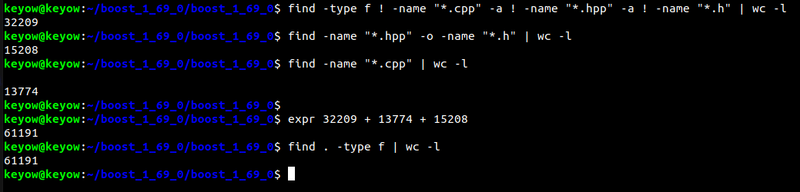
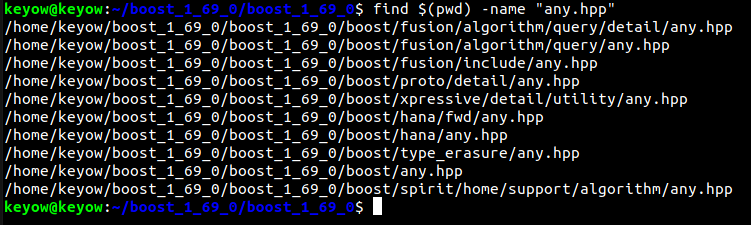
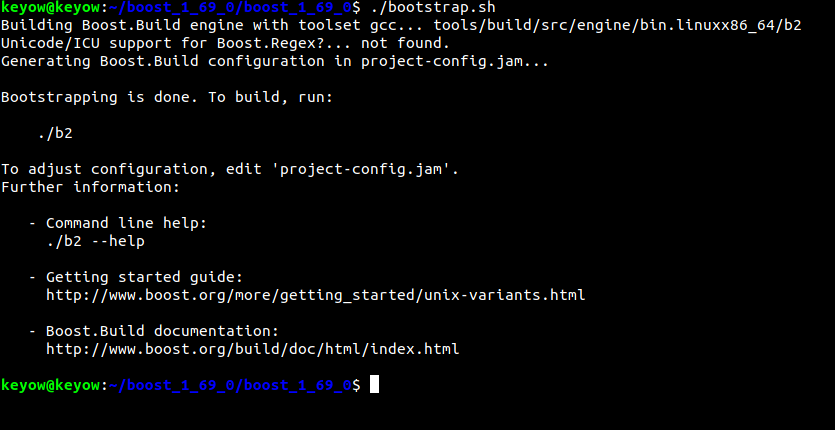
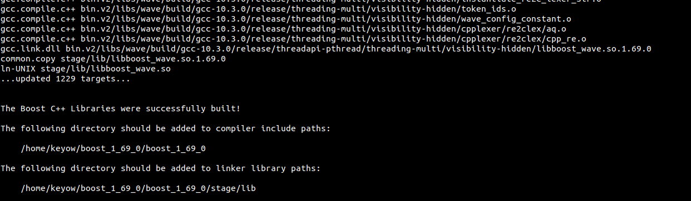
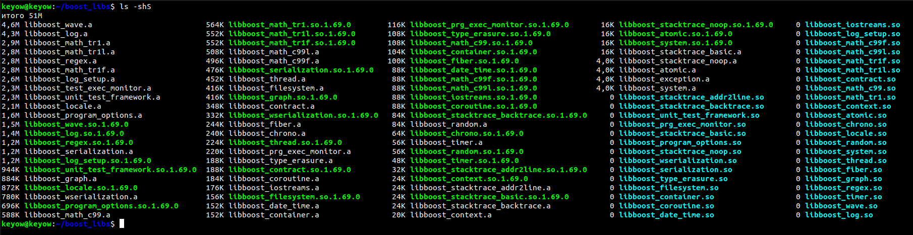
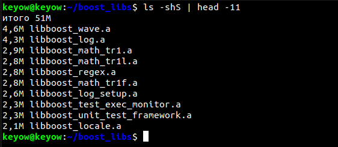

### Homework tasks
1. Скачиваем библиотеку boost: 

`wget https://sourceforge.net/projects/boost/files/boost/1.69.0/boost_1_69_0.tar.gz`

2. Разархивируем пакет boost в директорию ~/boost_69_0:

`tar -xf /boost_1_69_0.tar.gz`

>*Примечание*:
`-x` - extract, `-f` - from file

3. Количество файлов в библиотеке boost, **не включая** вложенные директории:

Сначала перейдём в каталог /boost_1_69_0:

`cd ~/boost_1_69_0`

Посчитаем количество файлов в библиотеке, не включая вложенные директории
(то есть нам нужно посчитать количество **файлов** в директории boost_1_69_0, не считая количестов файлов
в поддиректориях)

- `ls | wc -l` - количество всех файлов (и директорий) в текущем каталоге `~/boost_1_69_0`

- `find . -maxdepth 1 -type f | wc -l` - количество всех файлов (и только файлов) в текущем каталоге `~/boost_1_69_0`

>*Примечание*:
>На самом деле команда find по умолчанию также выводит и скрытые файлы (`начинаются с /.`)
>Для того, чтобы выводить файлы, не являющиеся скрытыми, нужно использовать следующую команду:
>`find . -maxdepth 1 ! -name ".*" -type f | wc -l `

4. Количество файлов в библиотеке, **включая** вложенные директории:

Находясь в каталоге `~/boost_1_69_0`, прописываем команду:

- `find . -type f | wc -l` - только файлы

>*Примечание*:
> Для того, чтобы подсчитать не только количество файлов, но и количество директорий (вложенных),
> повторяем вторую команду из задания №3 без параметров:
> `find | wc -l`. Результат легко проверяется сложением результатов выполнения двух команд:
> `find -type d | wc -l` и `find -type f | wc -l`

5. Подсчитаем количество заголовочных файлов, файлов с расширением `.cpp`, сколько остальных файлов (не заголовочных и не `.cpp`).

Для того, чтобы подсчитать количество заголовочных файлов, используем команду:

- `expr $(find -name "*.h" | wc -l) + $(find -name "*.hpp" | wc -l)`

Или просто используем флаг `-o` (OR)

- `find -name "*.h" -o -name "*.hpp" | wc -l`

Для того, чтобы подсчитать количество `.cpp` фалов, используем команду:

- `find -name "*.cpp" | wc -l`

Для того, чтобы подсчитать количество **НЕ** `.cpp` и **НЕ** `.hpp` (`.h`) файлов, используем команду:

- `find -type f ! -name "*.cpp" -a ! -name "*.hpp" -a ! -name "*.h" | wc -l`

Очевидно, что в сумме результат второй, третьей и четвертой команды даст результат 
команды `find . -type f | wc -l`:

6. Найдём полный путь до файла `any.hpp` внутри библиотеки *boost*., используя следующую команду:

- `find $(pwd) -name "any.hpp"`

В результате выведется путь до нескольких файлов `any.hpp`:

7. Выведем в консоль все файлы, где упоминается последовательность `boost::asio`, следующим образом:

- `grep -rl "boost::asio"`

Параметр `-r` обозначает recursive (поиск по всем подкаталогам), `-l` - ищет те **файлы**, в которых встречается
указанная последовательность символов

8. Скомпилирутйе *boost*. Можно воспользоваться [инструкцией](https://www.boost.org/doc/libs/1_61_0/more/getting_started/unix-variants.html#or-build-custom-binaries) или [ссылкой](https://codeyarns.com/2017/01/24/how-to-build-boost-on-linux/).

- Прописываем `./bootstrap.sh`:

- Прописываем `./b2`. Получаем следующее:

Теперь библиотеку можно использовать.

9. Перенесём все скомпилированные на предыдущем шаге статические библиотеки в директорию `~/boost-libs`.

Все установленные и скомпилированные статистические библиотеки находятся в директории
`stage/lib`
Перенесём эту директорию в директорию `~boost-libs`, используя следующую команду:

`mv /stage/lib ~/boost_libs`

10. Подсчитаем, сколько занимает дискового пространства каждый файл в этой директории.

Используем команду `ls -shS`, где параметр `-s` выводит размер каждого файла в блоках (по умолчанию
размер блока составляет 4кб), параметр `-h` выводит размер в удобной для пользователя форме, `-S` сортирует по убыванию (по размеру)

Можно использовать команду `ls -shrS`, где параметр `-r` устанавливает сортировку по возрастанию.
11. *Топ-10* самых "тяжёлых":
Используем команду `ls -shS` с ограничением в 11 строк (1 строка - размер каталога)

- `ls -shS | head -11`

Получаем следующее:

